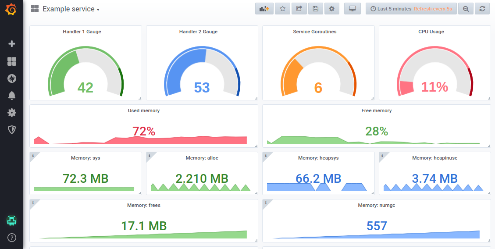
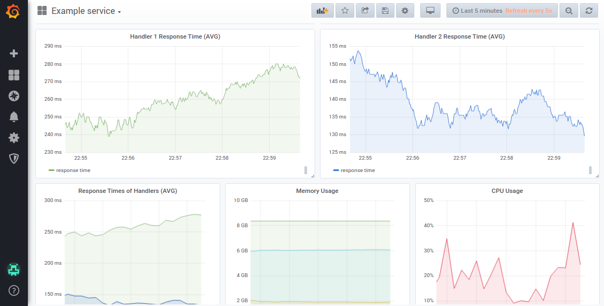

# GO - Prometheus

[](https://github.com/takattila/prometheus/actions?query=workflow:Test)
[](https://coveralls.io/github/takattila/prometheus?branch=master)
[](https://godoc.org/github.com/takattila/prometheus)
[](https://github.com/takattila/prometheus/releases)

This package is a Prometheus implementation for metrics.



It **provides statistics** as well:

- **Goroutines** (count)
- **Memory** usage (bytes)

  - **System**:
  
    - `Total`: total amount of RAM on this system
    - `Avail`: RAM available for programs to allocate
    - `Used` (bytes): RAM used by programs
    - `Free`: this is the kernel's notion of free memory
    - `Used` (percent): percentage of RAM used by programs
    
  - **Used by the application**:
  
    - `Sys`: the total bytes of memory obtained from the OS
    - `Alloc`: bytes of allocated heap objects
    - `HeapSys`: bytes of heap memory obtained from the OS
    - `HeapInuse`: bytes in in-use spans
    - `NumGC`: the number of completed GC cycles

- **CPU** usage (percentage)


## Table of contents

* [Example usage](#example-usage)
   * [Initialization](#initialization)
      * [Example code](#example-code)
      * [Example output](#example-output)
   * [Counter](#counter)
      * [Example code](#example-code-1)
      * [Example output](#example-output-1)
   * [Gauge](#gauge)
      * [Example code](#example-code-2)
      * [Example output](#example-output-2)
   * [Histogram](#histogram)
      * [Example code](#example-code-3)
      * [Example output](#example-output-3)
   * [Other examples](#other-examples)

## Example usage

### Initialization

#### Example code

```go
p := prometheus.New(prometheus.Init{
    // Obligatory fields
    Host:        "0.0.0.0",
    Port:        prometheus.GetFreePort(),
    Environment: "test",
    AppName:     "ExampleService",

    // Optional fields
    MetricEndpoint:      "/metrics", // default: /metrics
    StatCountGoroutines: true,       // default: false
    StatMemoryUsage:     true,       // default: false
    StatCpuUsage:        true,       // default: false
})
```

[Back to top](#table-of-contents)

#### Example output

```json
{
  "Addr": "0.0.0.0:40045",
  "Env": "test",
  "App": "ExampleService",
  "MetricsEndpoint": "/metrics",
  "StatCountGoroutines": true,
  "StatMemoryUsage": true,
  "StatCpuUsage": true
}

```

[Back to top](#table-of-contents)

### Counter
Counter is a cumulative metric that represents a single monotonically increasing counter
whose value can only increase or be reset to zero on restart.

For example, you can use a counter to represent the number
of requests served, tasks completed, or errors.
#### Example code

```go
err := p.Counter("response_status", 1, prometheus.Labels{
    "handler":    "MyHandler1",
    "statuscode": "200",
})

fmt.Println(p.GetMetrics("response_status"))
```

[Back to top](#table-of-contents)

#### Example output

```bash
# HELP response_status Counter created for response_status
# TYPE response_status counter
response_status{app="ExampleCounter",env="test",handler="MyHandler1",statuscode="200"} 1
```

[Back to top](#table-of-contents)

### Gauge
Gauge is a metric that represents a single numerical value
that can arbitrarily go up and down.

Gauges are typically used for measured values like temperatures
or current memory usage, but also "counts" that can go up and down,
like the number of concurrent requests.

#### Example code

```go
err := p.Gauge("cpu_usage_example", 15, prometheus.Labels{
    "core": "0",
})

fmt.Println(p.GetMetrics("cpu_usage"))
```

[Back to top](#table-of-contents)

#### Example output

```bash
# HELP cpu_usage Gauge created for cpu_usage
# TYPE cpu_usage gauge
cpu_usage{app="ExampleGauge",core="0",env="test"} 15
```

[Back to top](#table-of-contents)

### Histogram
Histogram samples observations (usually things like request durations
or response sizes) and counts them in configurable buckets.
It also provides a sum of all observed values.
A histogram with a base metric name of <basename>
exposes multiple time series during a scrape:

  - cumulative counters for the observation buckets, exposed
    as <basename>_bucket{le="<upper inclusive bound>"}
  - the total sum of all observed values, exposed as <basename>_sum
  - the count of events that have been observed, exposed
    as <basename>_count (identical to <basename>_bucket{le="+Inf"} above)

#### Example code

```go
	start := time.Now()

	// Elapsed time to measure the computation time
	// of a given function, handler, etc...
	defer func(begin time.Time) {
		units := prometheus.GenerateUnits(0.05, 0.05, 5)
		since := time.Since(begin).Seconds()

		err := p.Histogram("get_stat", since, prometheus.Labels{
			"handler": "purchases",
		}, units...)

		if err != nil {
			log.Fatal(err)
		}
	}(start)

	time.Sleep(100 * time.Millisecond)
```

[Back to top](#table-of-contents)

#### Example output

```bash
# HELP get_stat Histogram created for get_stat
# TYPE get_stat histogram
get_stat_bucket{app="ExampleElapsedTime",env="test",handler="purchases",le="0.05"} 0
get_stat_bucket{app="ExampleElapsedTime",env="test",handler="purchases",le="0.1"} 0
get_stat_bucket{app="ExampleElapsedTime",env="test",handler="purchases",le="0.15000000000000002"} 1
get_stat_bucket{app="ExampleElapsedTime",env="test",handler="purchases",le="0.2"} 1
get_stat_bucket{app="ExampleElapsedTime",env="test",handler="purchases",le="0.25"} 1
get_stat_bucket{app="ExampleElapsedTime",env="test",handler="purchases",le="+Inf"} 1
get_stat_sum{app="ExampleElapsedTime",env="test",handler="purchases"} 0.100132995
get_stat_count{app="ExampleElapsedTime",env="test",handler="purchases"} 1
```

[Back to top](#table-of-contents)

### Other examples

For more examples, please visit: [godoc page](https://godoc.org/github.com/takattila/prometheus#pkg-examples) .

[Back to top](#table-of-contents)


