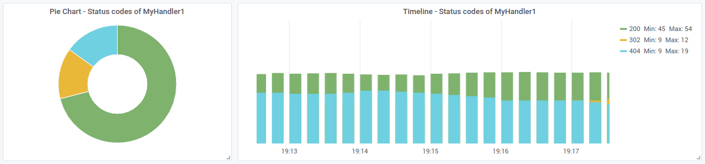
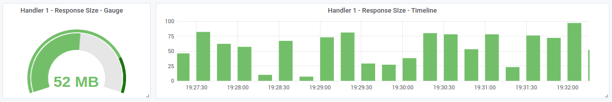
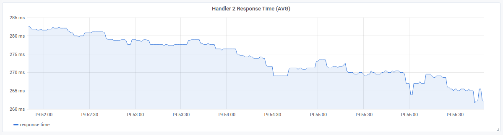
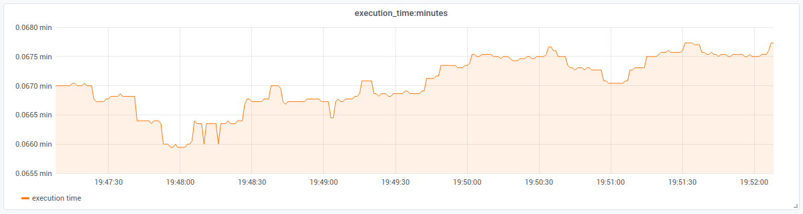
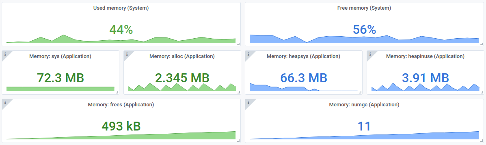

# GO - Prometheus

[](https://github.com/takattila/prometheus/actions?query=workflow:Test)
[](https://coveralls.io/github/takattila/prometheus?branch=master)
[](https://pkg.go.dev/github.com/takattila/prometheus?tab=doc)
[](https://github.com/takattila/prometheus/releases)

This package is a Prometheus implementation for metrics.
In its creation, the main consideration was the ease of use.

Provides the following metric types:
  - [Counter](#counter),
  - [Gauge](#gauge),
  - [Histogram](#histogram).

It can also provide [built-in statistics](#built-in-statistics) (optionally)
about the system and the application:
  - Goroutines,
  - Memory usage,
  - CPU usage.

Pprof HTTP server [can be enabled](#enable-pprof) to get runtime profiling data
on `Host:Port/debug/pprof/` endpoint.

## Table of contents

* [Example usage](#example-usage)
   * [Initialization](#initialization)
      * [Example code](#example-code)
      * [Example output](#example-output)
   * [Counter](#counter)
      * [Example code](#example-code-1)
      * [Example output](#example-output-1)
      * [Example Query](#example-query)
      * [Grafana Screenshot](#grafana-screenshot)
   * [Gauge](#gauge)
      * [Example code](#example-code-2)
      * [Example output](#example-output-2)
      * [Example Query](#example-query-1)
      * [Grafana Screenshot](#grafana-screenshot-1)
   * [Histogram](#histogram)
      * [Example code](#example-code-3)
      * [Example output](#example-output-3)
      * [Example Query](#example-query-2)
      * [Grafana Screenshot](#grafana-screenshot-2)
   * [Measure execution time](#measure-execution-time)
      * [Example code](#example-code-4)
      * [Example output](#example-output-4)
      * [Example Query](#example-query-3)
      * [Grafana Screenshot](#grafana-screenshot-3)
   * [Other examples](#other-examples)
* [Built-in statistics](#built-in-statistics)
   * [Detailed List of Statistics](#detailed-list-of-statistics)
   * [Example Queries](#example-queries)
   * [Grafana Screenshot](#grafana-screenshot-4)
* [Enable pprof](#enable-pprof)
   * [Available profiles](#available-profiles)
   * [Example code](#example-code-5)
* [Example Sevice - GO Source Code](EXAMPLE_SERVICE_GO.md#example-sevice---go-source-code)
* [Example Sevice - Grafana Dashboard](EXAMPLE_SERVICE_GRAFANA.json#example-sevice---grafana-dashboard)

## Example usage

### Initialization

#### Example code

```go
p := prometheus.New(prometheus.Init{
    // Obligatory fields
    Host:        "0.0.0.0",
    Port:        prometheus.GetFreePort(),
    Environment: "test",
    AppName:     "ExampleService",

    // Optional fields
    MetricEndpoint:      "/metrics", // default: /metrics
    StatCountGoroutines: true,       // default: false
    StatMemoryUsage:     true,       // default: false
    StatCpuUsage:        true,       // default: false
    EnablePprof:         true,       // default: false, endpoint: /debug/pprof/
})
```

[Back to top](#table-of-contents)

#### Example output

```json
{
  "Addr": "0.0.0.0:40045",
  "Env": "test",
  "App": "ExampleService",
  "MetricsEndpoint": "/metrics",
  "StatCountGoroutines": true,
  "StatMemoryUsage": true,
  "StatCpuUsage": true,
  "EnablePprof": true
}

```

[Back to top](#table-of-contents)

### Counter

Counter is a cumulative metric that represents a single monotonically increasing counter
whose value can only increase or be reset to zero on restart.

For example, you can use a counter to represent the number
of requests served, tasks completed, or errors.

#### Example code

```go
err := p.Counter(prometheus.CounterArgs{
    MetricName: "response_status",
    Labels:     prometheus.Labels{"handler": "MyHandler1", "statuscode": "200"},
    Value:      1,
})

if err != nil {
    log.Fatal(err)
}

fmt.Println(p.GetMetrics("response_status"))
```

[Back to top](#table-of-contents)

#### Example output

```bash
# HELP response_status Counter created for response_status
# TYPE response_status counter
response_status{app="ExampleService",env="test",handler="MyHandler1",statuscode="200"} 1
```

[Back to top](#table-of-contents)

#### Example Query

```bash
# Pie Chart 
response_status{app="ExampleService",env="test",handler="MyHandler1"}

# Timeline
sum(
  increase(
    response_status{app="ExampleService",env="test",handler="MyHandler1"}[5m]
  )
) by(statuscode)
```

[Back to top](#table-of-contents)

#### Grafana Screenshot



[Back to top](#table-of-contents)

### Gauge

Gauge is a metric that represents a single numerical value
that can arbitrarily go up and down.

Gauges are typically used for measured values like temperatures
or current memory usage, but also "counts" that can go up and down,
like the number of concurrent requests.

#### Example code

```go
err := p.Gauge(prometheus.GaugeArgs{
    MetricName: "response_size",
    Labels:     prometheus.Labels{"handler": "MyHandler1"},
    Value:      float64(rand.Intn(100)),
})

if err != nil {
    log.Fatal(err)
}

fmt.Println(p.GetMetrics("response_size"))
```

[Back to top](#table-of-contents)

#### Example output

```bash
# HELP response_size Gauge created for response_size
# TYPE response_size gauge
response_size{app="exampleService",env="test",handler="MyHandler1"} 52
```

[Back to top](#table-of-contents)

#### Example Query

```bash
response_size{app="exampleService",env="test",handler="MyHandler1"}
```

[Back to top](#table-of-contents)

#### Grafana Screenshot



[Back to top](#table-of-contents)

### Histogram

Histogram samples observations (usually things like request durations
or response sizes) and counts them in configurable buckets.
It also provides a sum of all observed values.
A histogram with a base metric name of <basename>
exposes multiple time series during a scrape:

  - cumulative counters for the observation buckets, exposed
    as <basename>_bucket{le="<upper inclusive bound>"}
  - the total sum of all observed values, exposed as <basename>_sum
  - the count of events that have been observed, exposed
    as <basename>_count (identical to <basename>_bucket{le="+Inf"} above)

#### Example code

```go
// Elapsed time to measure the computation time
// of a given function, handler, etc...
defer func(begin time.Time) {
	err := p.Histogram(prometheus.HistogramArgs{
        MetricName: "response_time:milli_sec",
        Labels:     prometheus.Labels{"handler": "MyHandler1"},
        Units:      prometheus.GenerateUnits(0.05, 0.05, 10),
        Value:      time.Since(begin).Seconds(),
    })

	if err != nil {
		log.Fatal(err)
	}
}(time.Now())
```

[Back to top](#table-of-contents)

#### Example output

```bash
# HELP response_time:milli_sec Histogram created for response_time:milli_sec
# TYPE response_time:milli_sec histogram
response_time:milli_sec_bucket{app="exampleService",env="test",handler="MyHandler2",le="0.05"} 47
response_time:milli_sec_bucket{app="exampleService",env="test",handler="MyHandler2",le="0.1"} 93
response_time:milli_sec_bucket{app="exampleService",env="test",handler="MyHandler2",le="0.15"} 145
response_time:milli_sec_bucket{app="exampleService",env="test",handler="MyHandler2",le="0.2"} 190
response_time:milli_sec_bucket{app="exampleService",env="test",handler="MyHandler2",le="0.25"} 238
response_time:milli_sec_bucket{app="exampleService",env="test",handler="MyHandler2",le="0.3"} 287
response_time:milli_sec_bucket{app="exampleService",env="test",handler="MyHandler2",le="0.35"} 287
response_time:milli_sec_bucket{app="exampleService",env="test",handler="MyHandler2",le="0.4"} 287
response_time:milli_sec_bucket{app="exampleService",env="test",handler="MyHandler2",le="0.45"} 287
response_time:milli_sec_bucket{app="exampleService",env="test",handler="MyHandler2",le="0.5"} 287
response_time:milli_sec_bucket{app="exampleService",env="test",handler="MyHandler2",le="+Inf"} 287
response_time:milli_sec_sum{app="exampleService",env="test",handler="MyHandler2"} 42.85663311700002
response_time:milli_sec_count{app="exampleService",env="test",handler="MyHandler2"} 287
```

[Back to top](#table-of-contents)

#### Example Query

```bash
histogram_quantile(0.9,
    rate(
        execution_time:milli_sec_bucket{app="exampleService",env="test",handler="MyHandler1"}[5m]
    )
) 
```

[Back to top](#table-of-contents)

#### Grafana Screenshot



[Back to top](#table-of-contents)

### Measure execution time

To measure the runtime of a particular calculation use `StartMeasureExecTime` function.

#### Example code

```go
m := p.StartMeasureExecTime(prometheus.MeasureExecTimeArgs{
    MetricName:   "execution_time:minutes",
    Labels:       prometheus.Labels{"handler": handlerName},
    Units:        prometheus.GenerateUnits(0.005, 0.005, 20),
    TimeDuration: time.Minute,
})

time.Sleep(time.Duration(rand.Intn(5)) * time.Second)

err := m.StopMeasureExecTime()
if err != nil {
    log.Fatal(err)
}

fmt.Println(p.GetMetrics("execution_time:minutes"))
```

[Back to top](#table-of-contents)

#### Example output

```bash
# HELP execution_time:minutes Histogram created for execution_time:minutes
# TYPE execution_time:minutes histogram
execution_time:minutes_bucket{app="exampleService",env="test",handler="MyHandler1",le="0.005"} 119
execution_time:minutes_bucket{app="exampleService",env="test",handler="MyHandler1",le="0.01"} 119
execution_time:minutes_bucket{app="exampleService",env="test",handler="MyHandler1",le="0.015"} 119
execution_time:minutes_bucket{app="exampleService",env="test",handler="MyHandler1",le="0.02"} 228
execution_time:minutes_bucket{app="exampleService",env="test",handler="MyHandler1",le="0.025"} 228
execution_time:minutes_bucket{app="exampleService",env="test",handler="MyHandler1",le="0.03"} 228
execution_time:minutes_bucket{app="exampleService",env="test",handler="MyHandler1",le="0.035"} 338
execution_time:minutes_bucket{app="exampleService",env="test",handler="MyHandler1",le="0.04"} 338
execution_time:minutes_bucket{app="exampleService",env="test",handler="MyHandler1",le="0.045"} 338
execution_time:minutes_bucket{app="exampleService",env="test",handler="MyHandler1",le="0.05"} 338
execution_time:minutes_bucket{app="exampleService",env="test",handler="MyHandler1",le="0.055"} 439
execution_time:minutes_bucket{app="exampleService",env="test",handler="MyHandler1",le="0.06"} 439
execution_time:minutes_bucket{app="exampleService",env="test",handler="MyHandler1",le="0.065"} 439
execution_time:minutes_bucket{app="exampleService",env="test",handler="MyHandler1",le="0.07"} 534
execution_time:minutes_bucket{app="exampleService",env="test",handler="MyHandler1",le="0.075"} 534
execution_time:minutes_bucket{app="exampleService",env="test",handler="MyHandler1",le="0.08"} 534
execution_time:minutes_bucket{app="exampleService",env="test",handler="MyHandler1",le="0.085"} 534
execution_time:minutes_bucket{app="exampleService",env="test",handler="MyHandler1",le="0.09"} 534
execution_time:minutes_bucket{app="exampleService",env="test",handler="MyHandler1",le="0.095"} 534
execution_time:minutes_bucket{app="exampleService",env="test",handler="MyHandler1",le="0.1"} 534
execution_time:minutes_bucket{app="exampleService",env="test",handler="MyHandler1",le="+Inf"} 534
execution_time:minutes_sum{app="exampleService",env="test",handler="MyHandler1"} 16.868514283549988
execution_time:minutes_count{app="exampleService",env="test",handler="MyHandler1"} 534
```

[Back to top](#table-of-contents)

#### Example Query

```bash
histogram_quantile(0.9,
    rate(
      execution_time:minutes_bucket{app="exampleService",env="test",handler="MyHandler1"}[5m]
    ) 
) 
```

[Back to top](#table-of-contents)

#### Grafana Screenshot



[Back to top](#table-of-contents)

### Other examples

For more examples, please visit: [pkg.go.dev](https://pkg.go.dev/github.com/takattila/prometheus?tab=doc#pkg-examples) page.

[Back to top](#table-of-contents)

## Built-in statistics

The following built-in system and application statistics can be turned on/off 
on Prometheus Object initialization.

```go
p := prometheus.New(prometheus.Init{
    // Obligatory fields
    Host:        "0.0.0.0",
    Port:        prometheus.GetFreePort(),
    Environment: "test",
    AppName:     "ExampleService",

    // Application and system statistics fields
    StatCountGoroutines: true,       // default: false
    StatMemoryUsage:     true,       // default: false
    StatCpuUsage:        true,       // default: false
})
```

### Detailed List of Statistics

- **Goroutines** (count) `StatCountGoroutines: true`
- **Memory** usage `StatMemoryUsage: true`

  - **System**:
  
    - `Total`: total amount of RAM on this system
    - `Avail`: RAM available for programs to allocate
    - `Used` (bytes): RAM used by programs
    - `Free`: this is the kernel's notion of free memory
    - `Used` (percent): percentage of RAM used by programs
    
  - **Used by the application**:
  
    - `Sys`: the total bytes of memory obtained from the OS
    - `Alloc`: bytes of allocated heap objects
    - `HeapSys`: bytes of heap memory obtained from the OS
    - `HeapInuse`: bytes in in-use spans
    - `NumGC`: the number of completed GC cycles

- **CPU** usage (percentage) `StatCpuUsage: true`

[Back to top](#table-of-contents)

### Example Queries

```bash
# Used memory (System)
stat_memory_usage:used_percent{app="ExampleService",env="test"}

# Memory: sys (Application)
stat_memory_usage:sys{app="ExampleService",env="test"}

# Memory: alloc (Application)
stat_memory_usage:alloc{app="ExampleService",env="test"}

# Memory: frees (Application)
stat_memory_usage:frees{app="ExampleService",env="test"}

# Free memory (System)
100 - stat_memory_usage:used_percent{app="ExampleService",env="test"}

# Memory: sys (Application)
stat_memory_usage:sys{app="ExampleService",env="test"}

# Memory: heapsys (Application)
stat_memory_usage:heapsys{app="ExampleService",env="test"}

# Memory: heapinuse (Application)
stat_memory_usage:heapinuse{app="ExampleService",env="test"}

# Memory: numgc (Application)
stat_memory_usage:numgc{app="ExampleService",env="test"}
```

[Back to top](#table-of-contents)

### Grafana Screenshot



[Back to top](#table-of-contents)

## Enable pprof

Enable pprof HTTP server to get runtime profiling data on `Host:Port/debug/pprof/` endpoint.

### Available profiles

- allocs
- block
- cmdline
- goroutine
- heap
- mutex
- profile
- threadcreate
- trace

[Back to top](#table-of-contents)

### Example code

```go
p := prometheus.New(prometheus.Init{
    // Obligatory fields
    Host:        "0.0.0.0",
    Port:        prometheus.GetFreePort(),
    Environment: "test",
    AppName:     "ExampleService",

    // Endpoint: /debug/pprof/
    EnablePprof: true, // default: false, 
})
```

[Back to top](#table-of-contents)
